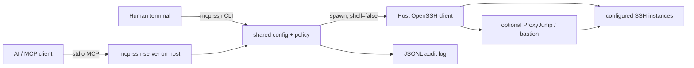

# mcp_ssh_connectors

A policy-gated Model Context Protocol server and local terminal tool that let an AI use the **host machine's OpenSSH client** to reach configured SSH instances, even when the model sandbox has no direct network path.

通过宿主机的 OpenSSH 客户端，把受策略限制的 SSH 能力提供给 AI；同时提供人类可直接在终端运行的 `mcp-ssh` 工具。

> Security first: MCP can use only named targets and allowlisted commands. It cannot submit arbitrary hosts, SSH options, or private-key material.

## Architecture



The server uses the official MCP TypeScript SDK v2 and the 2026-07-28 protocol generation. Node.js 20+ and an OpenSSH-compatible `ssh` executable are required.

## What is included

- MCP tools: `ssh_list_targets`, `ssh_preview`, `ssh_check`, `ssh_exec`
- Local CLI: `init`, `targets`, `preview`, `check`, `exec`, `connect`, `mcp`
- Named-target isolation and regular-expression command policy
- Strict host-key checking, non-interactive MCP execution, timeouts, and output caps
- JSONL auditing with command hashing by default
- ProxyJump, identity-file, port, and dedicated known-hosts support
- CI and policy tests

## Quick start

```bash
git clone https://github.com/xtawa/mcp_ssh_connectors.git
cd mcp_ssh_connectors
npm install
npm run check
npm link

mcp-ssh init
$EDITOR ~/.config/mcp-ssh/config.json
```

You can also copy `config.example.json`. Do not put private-key contents or passwords in the config.

Trust and test a new host manually first so its key is present in `known_hosts`:

```bash
ssh example
mcp-ssh targets
mcp-ssh preview example -- uname -a
mcp-ssh check example
mcp-ssh exec example -- uname -a
```

Open a normal human-operated terminal session:

```bash
mcp-ssh connect example
```

`connect` is intentionally not exposed to MCP. It opens an interactive shell for the local operator and is not governed by command allow rules.

## Configure an MCP host

After `npm run build` or `npm link`, register the stdio server in your MCP client:

```json
{
  "mcpServers": {
    "ssh-connectors": {
      "command": "mcp-ssh-server",
      "env": {
        "MCP_SSH_CONFIG": "/absolute/path/to/config.json"
      }
    }
  }
}
```

Without `MCP_SSH_CONFIG`, the default is:

- Linux/macOS: `~/.config/mcp-ssh/config.json` (or `$XDG_CONFIG_HOME/mcp-ssh/config.json`)
- Windows: `%APPDATA%\\mcp-ssh\\config.json`

Restart the MCP server after changing the config.

## Configuration

```json
{
  "version": 1,
  "sshBinary": "ssh",
  "audit": {
    "required": true,
    "logCommands": false
  },
  "defaults": {
    "timeoutMs": 30000,
    "connectTimeoutSeconds": 10,
    "maxOutputBytes": 1048576,
    "knownHostsFile": "~/.ssh/known_hosts"
  },
  "policy": {
    "maxCommandLength": 4096,
    "deniedCommands": ["(?:^|\\s)sudo(?:\\s|$)"]
  },
  "targets": {
    "staging": {
      "destination": "deploy@10.0.20.15",
      "port": 22,
      "identityFile": "~/.ssh/staging_ed25519",
      "proxyJump": "bastion",
      "tags": ["staging", "linux"],
      "allowedCommands": [
        "^uname -a$",
        "^systemctl status [A-Za-z0-9_.@-]+$",
        "^journalctl -u [A-Za-z0-9_.@-]+ -n (?:50|100)$"
      ],
      "deniedCommands": ["(?:^|[;&|]\\s*)rm(?:\\s|$)"],
      "requireReason": true
    }
  }
}
```

Deny rules run before allow rules. A target with no `allowedCommands` is blocked by default. Commands must be single-line. Use anchored and argument-specific expressions rather than `.*`.

## Terminal commands

```text
mcp-ssh init [--config PATH]
mcp-ssh targets [--config PATH]
mcp-ssh preview TARGET [--reason TEXT] -- COMMAND
mcp-ssh check TARGET [--config PATH]
mcp-ssh exec TARGET [--reason TEXT] -- COMMAND
mcp-ssh connect TARGET [--config PATH]
mcp-ssh mcp [--config PATH]
```

For commands containing pipes, redirects, globbing, or spaces that must be preserved, pass the entire remote command as one quoted local argument:

```bash
mcp-ssh exec staging --reason "inspect errors" -- "journalctl -u api -n 100"
```

## MCP behavior

1. The model lists configured aliases with `ssh_list_targets`.
2. It can call `ssh_preview` to see whether a command is allowed without opening a connection.
3. `ssh_check` validates authentication and host-key trust with the remote no-op command `true`.
4. `ssh_exec` repeats policy evaluation, writes an audit start event, invokes OpenSSH with `shell=false`, captures bounded output, and writes a finish event.

The MCP command timeout may shorten but cannot extend the operator-configured target timeout.

## Security

Read [docs/security.md](docs/security.md) before exposing production targets. The key rules are:

- run as an unprivileged, dedicated OS account;
- use least-privilege SSH identities and remote accounts;
- keep strict host-key checking enabled;
- use narrow command allowlists and keep required auditing on;
- treat remote output as untrusted data;
- never store private-key material or passwords in MCP calls or config.

## Ideas and next steps

See [docs/roadmap.md](docs/roadmap.md) for human approvals, ephemeral SSH certificates, constrained SFTP tools, fleet blast-radius budgets, cached host facts, OpenTelemetry, and session recording.
